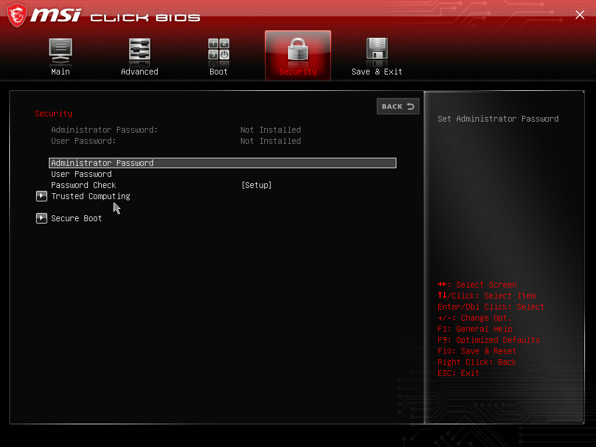
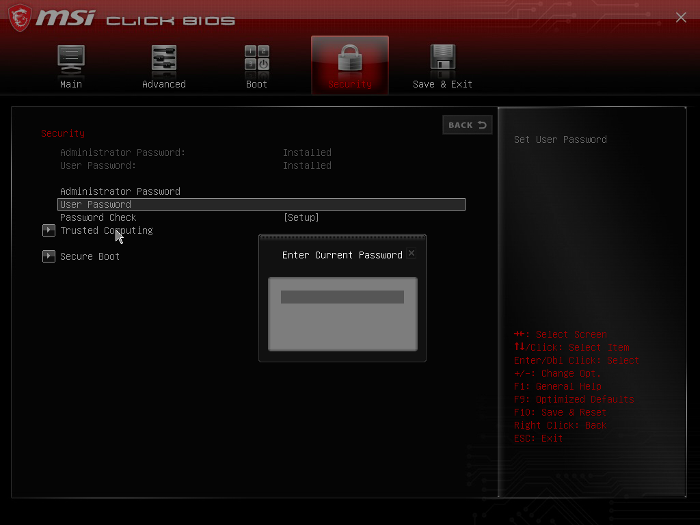
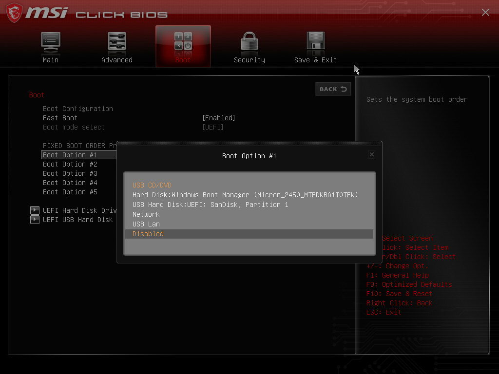
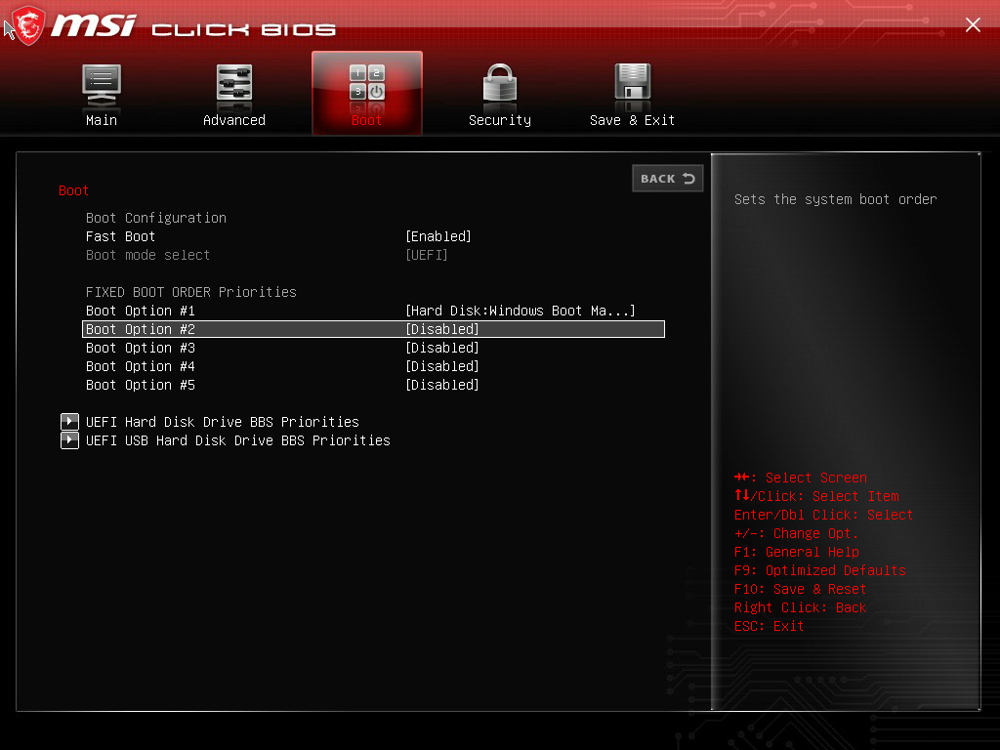
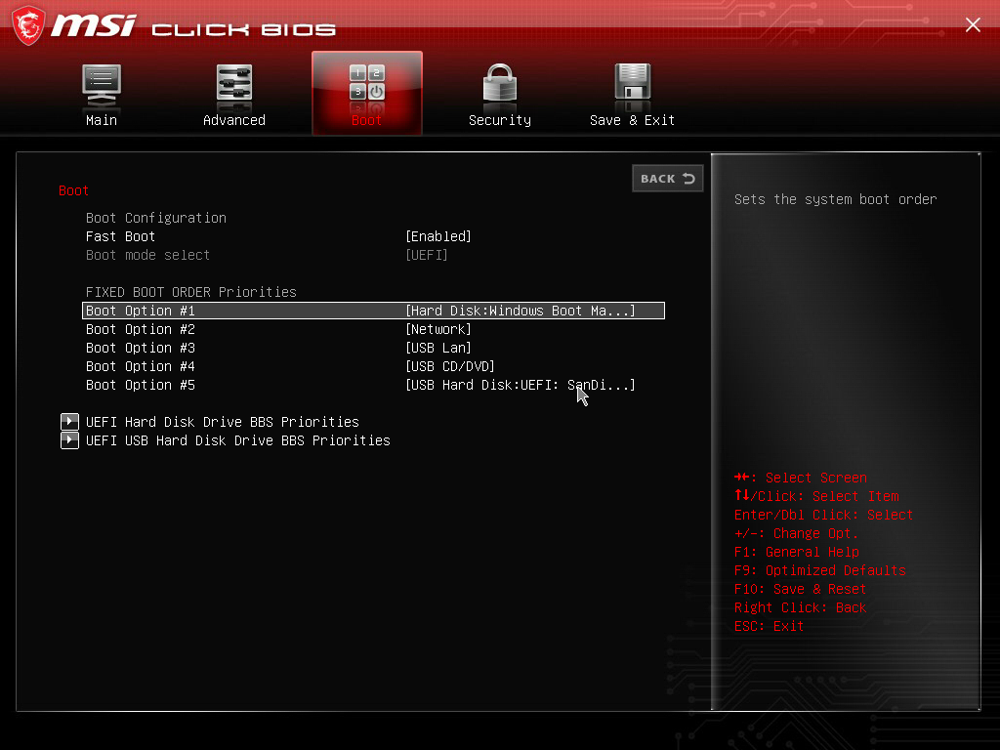
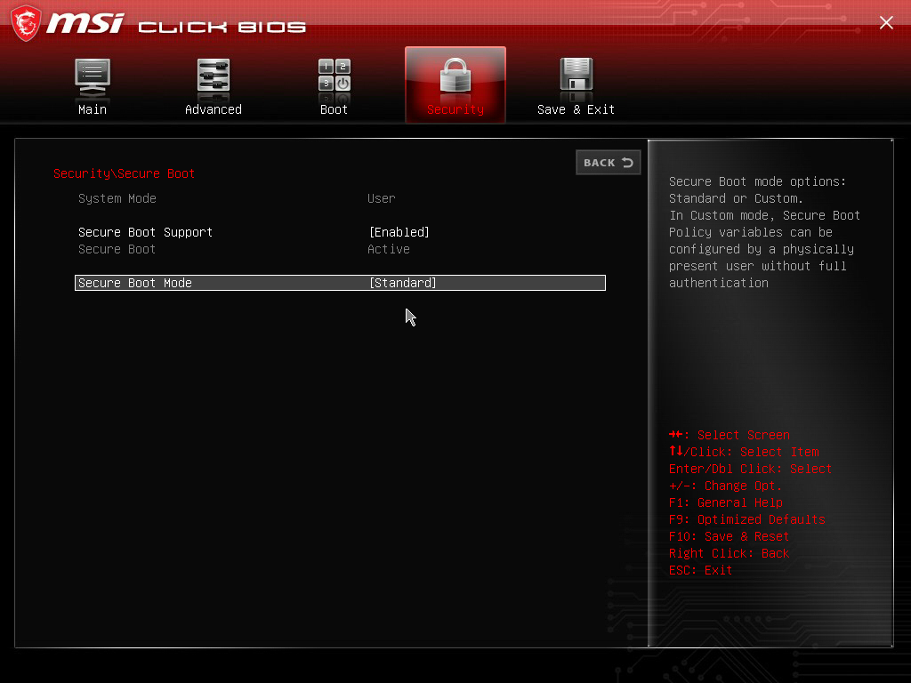

author: Juan Ramón González Hurtado
summary: Guía para bastionado de BIOS/UEFI
id: hardening_guia_BIOS
categories: codelab,markdown 
environments: Web 
status: Published 

 

# Bastionado de BIOS/UEFI

## Establecemos contraseñas

Para entrar en la BIOS reiniciamos nuestro sistema y pulsamos repetidamente la tecla suprimir.
Una vez, en la BIOS entramos en el menú de Seguridad:

### Contraseña de administrador de BIOS

Ahora vamos a establecer una contraseña para el administrador de la BIOS, de esta manera evitaremos que cualquiera que entre en la BIOS pueda modificar ciertos parámetros que pueden comprometer nuestro sistema.

 Seleccionamos la opción de <b> Administrator Password </b> 

### Contraseña de usuario o Power-On

Establecemos una contraseña para el arranque del sistema, añadiendo otra capa de seguridad más:

 Seleccionamos la opción de <b> User Password </b> 

## Opciones de arranque y permisos

En este apartado vamos a ver cómo podemos configurar los permisos para evitar el arranque desde dispositivos no autorizados y en su defecto modificar el orden del arranque de manera que sea lo más segura posible.

### Evitando el arranque desde dispositivos externos

Modificaremos los permisos de manera que sólo sea posible realizar el arranque desde el disco duro, dejando "Disabled" el resto de dispositivos:

El resultado sería el siguiente:

### Orden de arranque seguro

Vamos a evitar el arranque desde dispositivos priorizando el disco duro de nuestro sistema, de esta manera, mientras esté conectado nuestro disco duro, no podrán realizarse arranques desde dispositivos externos en caso de que tengan alguna clase de permiso para ello.

 En primer lugar, pondremos nuestro disco duro, luego seleccionaremos el resto de dispositivos en el siguiente orden: 

## Otras opciones de seguridad

En este apartado analizaremos otras opciones de seguridad como es el <b>Secure Boot</b>.

Secure Boot es una herramienta de seguridad que viene incluída en UEFI, y que impide la ejecución de software no firmado o certificado en el arranque del sistema. De esta manera nuestro PC arrancará sólo con software de confianza del OEM (fabricante de equipos originales)

Podemos usarlo simplemente como otra capa de seguridad en nuestro bastionado de la BIOS

A continuación veremos dónde podemos habilitarlo, aunque por defecto estará habilitado. Si no lo está habilitado lo habilitaremos dejando "Enabled" el <b>Secure Boot Support:</b>

 También existe la opción de personalizar el <b>Secure Boot</b> con otras claves de arranque seguro. 
